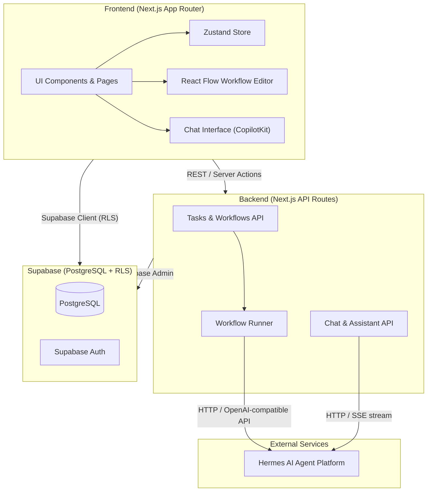
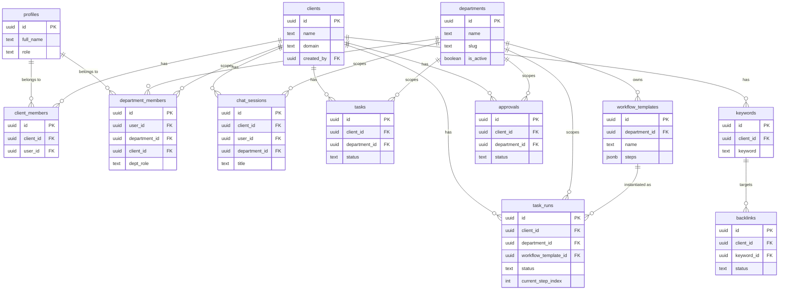

# Hermes Agency OS — Architecture

## Overview

**Hermes** is a multi-tenant, multi-department agency operating system built on Next.js 15 (App Router), Supabase, and the Hermes AI agent platform. It is designed to support multiple clients, each with multiple departments (SEO, Execution, Design) and multiple users per department.

## High-Level System Diagram



---

## Tech Stack

### Frontend
| Tech | Purpose |
|---|---|
| Next.js 15.5 (App Router) | Core framework, server components, routing |
| TypeScript | Type safety across front and back |
| Tailwind CSS v4 | Styling |
| Radix UI Primitives | Accessible headless components |
| Lucide React | Icons |
| Zustand | Client-side state (active client, etc.) |
| `@xyflow/react` | Visual drag-and-drop workflow editor |
| `@copilotkit/react-core` | Agentic chat UI integration |

### Backend
| Tech | Purpose |
|---|---|
| Next.js API Routes (`app/api/*`) | REST endpoints |
| Supabase (`@supabase/supabase-js`, `@supabase/ssr`) | PostgreSQL + Auth + Realtime |
| Docker + Docker Compose | Containerisation |
| Nginx | Reverse proxy, SSL termination |

---

## Directory Structure

```
agentic-seo/
├── app/
│   ├── (auth)/                  # Login / Signup pages
│   ├── api/
│   │   ├── chat/route.ts        # Chat → forwards to Hermes (SSE stream)
│   │   ├── workflows/
│   │   │   └── execute/route.ts # Trigger workflow step execution
│   │   ├── clients/route.ts     # Client CRUD
│   │   ├── tasks/               # Task read/write
│   │   └── approvals/           # Approval CRUD + decisions
│   └── dashboard/
│       ├── layout.tsx           # Auth guard + 3-column layout
│       ├── chat/[sessionId]/    # Per-session chat workspace
│       ├── tasks/               # Task list and detail views
│       ├── workflows/           # Workflow editor (React Flow)
│       ├── approvals/           # HITL approval queue
│       └── settings/            # User & client settings
│
├── components/
│   ├── sidebar/
│   │   ├── LeftSidebar.tsx      # Client switcher + chat sessions + nav
│   │   └── RightSidebar.tsx     # Contextual info panel
│   ├── chat/                    # Chat message components
│   ├── workflows/               # React Flow nodes, panels, editor
│   └── approvals/               # Approval card components
│
├── lib/
│   ├── hermes/
│   │   └── client.ts            # Hermes API client (department-aware system prompt)
│   ├── supabase/
│   │   ├── client.ts            # Browser Supabase client
│   │   ├── server.ts            # Server-side Supabase client (cookies)
│   │   ├── middleware.ts        # Session refresh middleware helper
│   │   └── types.ts             # Full TypeScript schema types + convenience aliases
│   └── workflows/
│       └── runner.ts            # WorkflowRunner engine
│
├── supabase/migrations/
│   ├── 001_initial_schema.sql   # Core tables: profiles, clients, chat, tasks, approvals
│   ├── 002_rls_policies.sql     # Row Level Security for all tables
│   ├── 005_workflows_schema.sql # workflow_templates + task_runs
│   ├── 006_backlinks_schema.sql # keywords + backlinks (SEO data)
│   └── 007_departments_schema.sql # ★ NEW: departments + department_members
│
└── docs/                        # ← You are here
    ├── README.md
    ├── architecture.md
    ├── gap_analysis.md
    ├── database_schema.md
    └── departments_setup.md
```

---

## Data Hierarchy (Agency OS Model)

```
Organization (Hermes Agency)
    └── Client  (e.g. "ABC Plumbing")
            └── Department  (e.g. "SEO Department")
                    └── DepartmentMember  (User + positional role)
                            └── Tasks / TaskRuns / Approvals / ChatSessions
```

### Database Relationship Diagram



---

## Workflow Execution Model

1. **Define**: User builds a workflow visually in React Flow → serialized as `workflow_templates.steps` (JSONB array).
2. **Trigger**: User selects a client and clicks "Run" → creates a `task_runs` row with `status: 'pending'`.
3. **Execute** (`lib/workflows/runner.ts`):
   - Reads current step from `task_runs.current_step_index`.
   - **`hermes_task` / `browser_use_task`**: Builds a department-aware system prompt and calls Hermes.
   - **`approval`**: Sets `status: 'waiting_approval'` and pauses. An admin approves via the Approvals UI.
4. **Continue**: After approval, the runner advances to the next step and recursively triggers itself via `POST /api/workflows/execute`.

---

## Role & Permission Model

### Global Role (on `profiles.role`) — Unchanged from V1
Controls top-level admin access. Still SEO-flavored in V1 but will be extended.

| Role | Access |
|---|---|
| `admin` | Everything |
| `seo_manager` | All SEO + Approval decisions |
| `seo_executive` | Assigned clients only |
| `content_writer` | Read access + content tasks |

### Positional Role (on `department_members.dept_role`) — Added in Phase 2
Per-user, per-department, per-client. This is the future-proof hierarchy.

| Role | Access |
|---|---|
| `department_head` | Full control of their department |
| `team_lead` | Can assign tasks within department |
| `employee` | Executes tasks in their department |
| `client_viewer` | Read-only access to reports |

---

## Hermes Agent Integration

All chat and workflow AI calls go through the Hermes platform (OpenAI-compatible endpoint).

Client isolation is enforced by injecting `client_id` into the system prompt on every call.
Department context is now injected via the `department` slug — each department gets a dedicated agent persona:

| Department | Persona |
|---|---|
| `seo` | Expert SEO Specialist |
| `execution` | Expert Digital Marketing Execution Specialist |
| `design` | Expert Creative Design Specialist |

The `buildClientSystemMessage()` function in `lib/hermes/client.ts` handles this.
